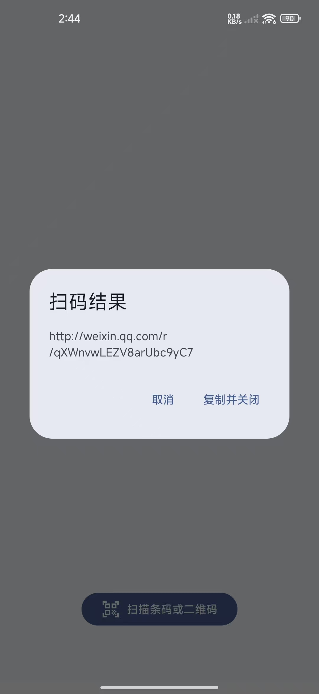
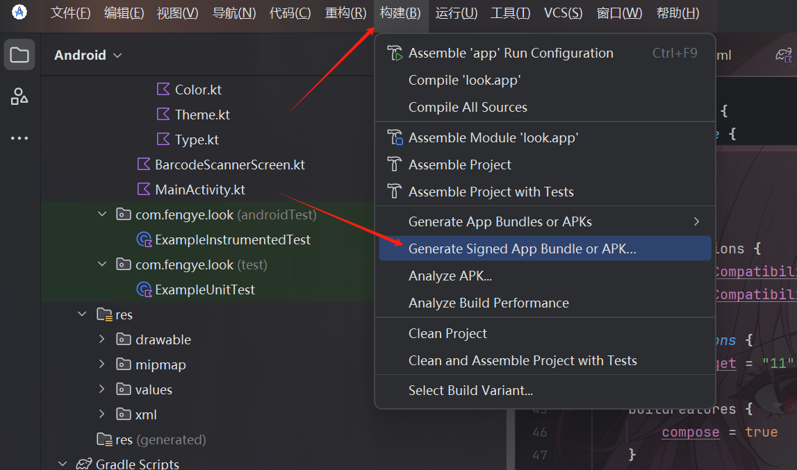
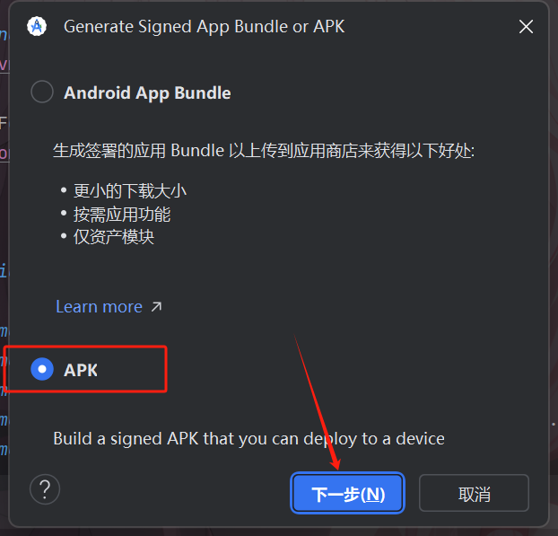
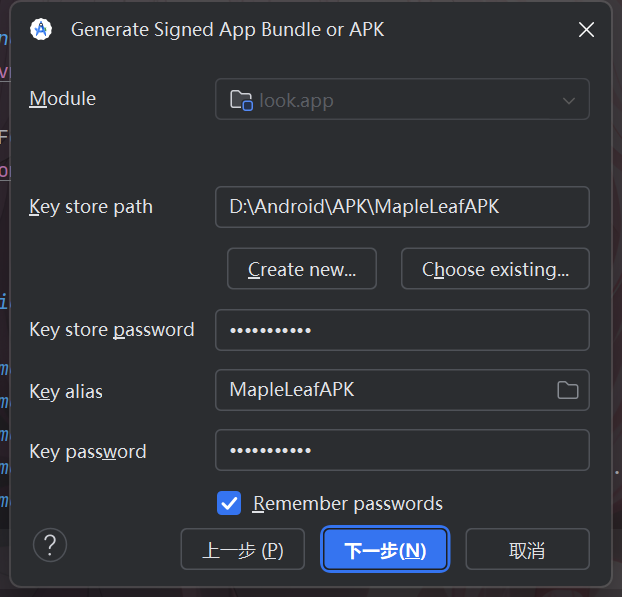
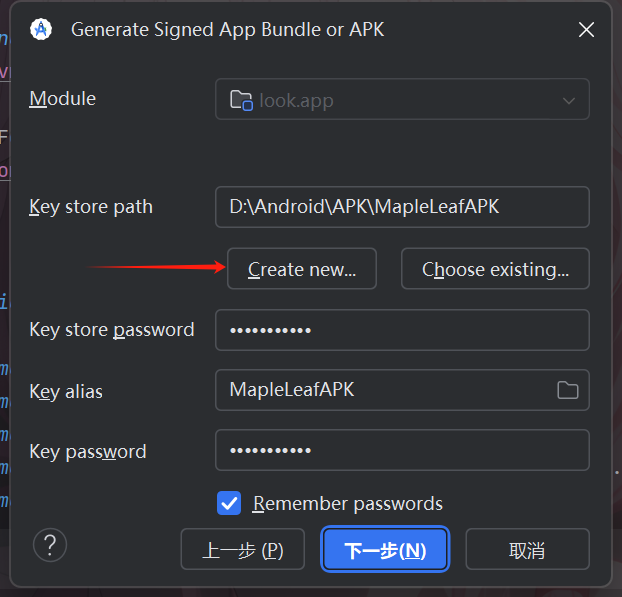
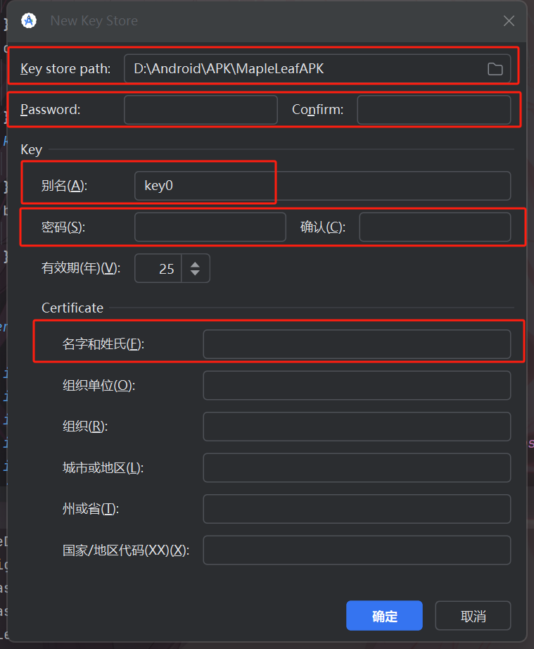
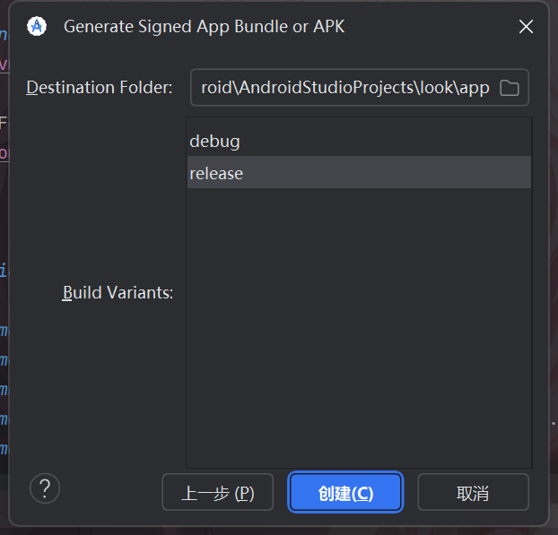

# 前言
在以前我一直使用的调试模式安装我的demo软件，直到最近我想互传给其他人使用时发现他们是始终安装不上，会失败

最近因为家里亲戚被熟知的二维码诈骗了，这让我觉得奥有必要重新认识一下二维码这个东西了，平时遇到网页地址还好办可以多个方式识别出是不是危险网站，但是二维码这个东西就不一样了，你啥也看不出，于是就有了我的新软件[look](https://wwer.lanzouw.com/i1K3c3598tbg)密码是**hnwf**，万物二维码都可以扫描，扫码后弹出内容，目前可以识别条形码和二维码
## 如图


干净清爽

目前应该就是这样，回归正题
# 准备

首先到构建中填写数据

因为我刚刚弄完所以这里就有信息了

选择这个新建

喜欢什么填写什么，就填写这几个就差不多了，你要是闲的可以全部填写

弄好后下一步

最后创建即可，然后观察错误信息，挨个修复即可

在build.gradle中
```java
android {
    lint {
        baseline = file("lint-baseline.xml")
    }
}
```
反正就是按照错误信息修复即可最后你就得到了文件在你的项目目录\app\release\中app-release.apk就是