# 前言
本次教程我们训练一个识别app图标和文件夹的yolo
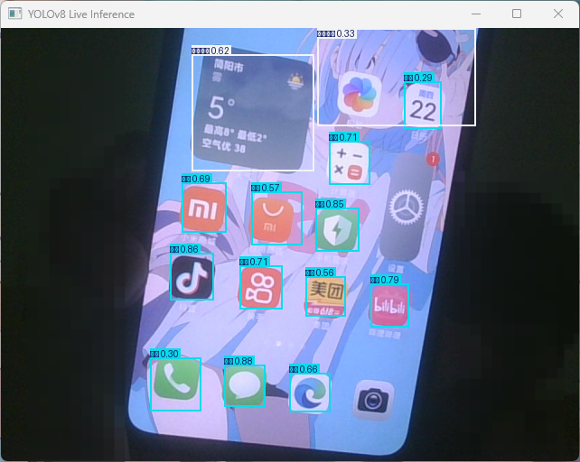
这个和yolo的各方数据有关，我就没有太对训练素材训练集也就5张图像
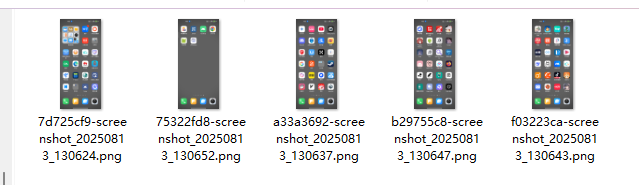
看几个直白的
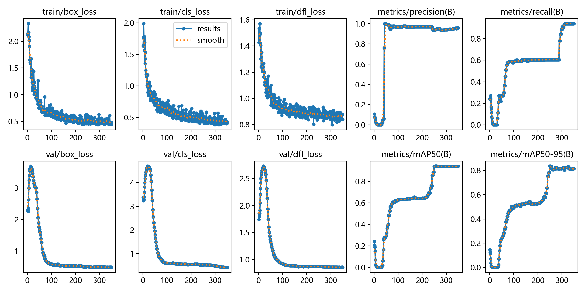
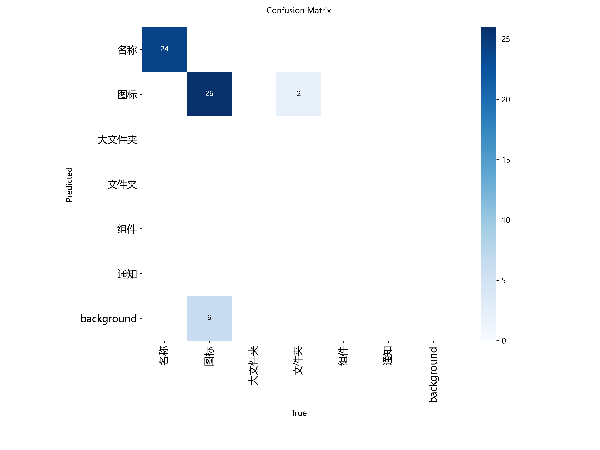
见笑了，也就大概这样吧，反正以跑通为主要

# 准备工作
既然要训练那就得准备数据，如果有就可以跳过了，没有的话就自己打标吧使用
::github{repo="HumanSignal/label-studio"}
标注工具我们对需要的数据进行打标签的操作

# 安装工作
首先我们安装一个[uv](https://docs.astral.sh/uv/)进行python的包和项目的管理
windows
```sh
powershell -ExecutionPolicy ByPass -c "irm https://astral.sh/uv/install.ps1 | iex"
```
[其他](https://docs.astral.sh/uv/getting-started/installation/#installation-methods)自行安装
安装完成在命令行输入`uv`查看是否有相关命令

# 准备工作
```sh
# 创建文件夹
mkdir demo
# 进入
cd demo
# 创建虚拟环境
uv venv
# 初始化项目
uv init
# 配置打标工具
uv pip install label-studio
# 启动工具
uv run label-studio
```
注册登录即可看到
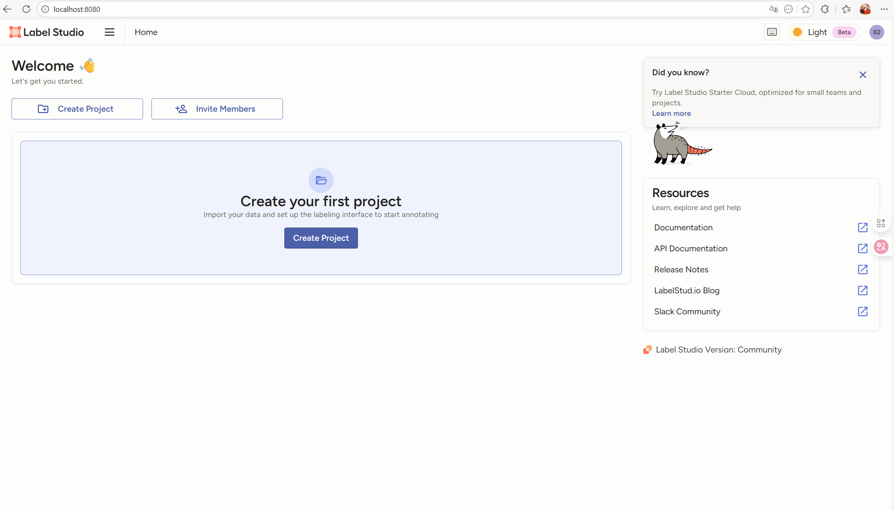
简单翻译一下就知道了，我们创建一个项目，上传图像
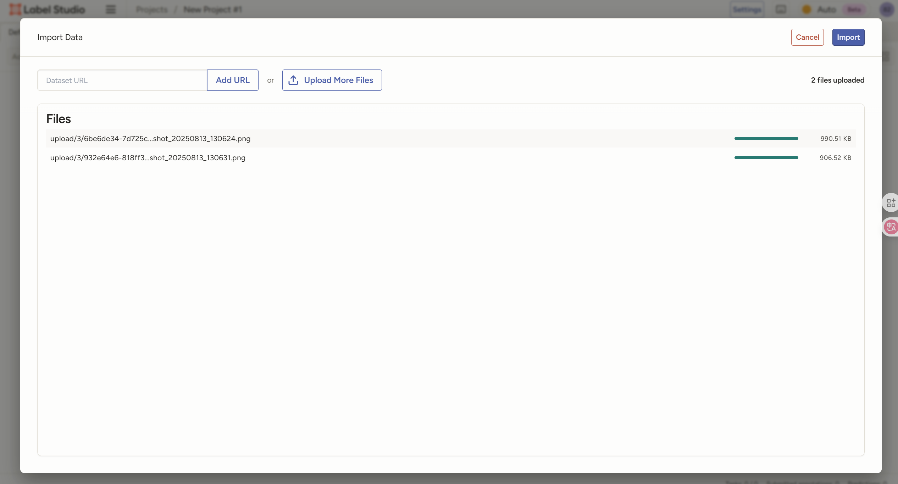
我这里是演示所以就上传了一点，一个好的训练数据集得1000+以上，所以我这个很糙
- 下一步
我们选择标签
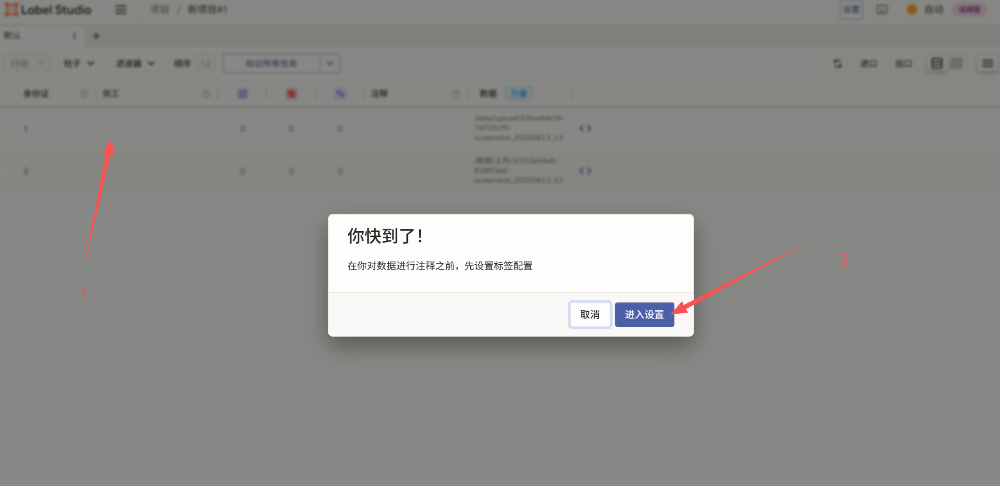
我们选择浏览模板，然后选择你对应的标签类型
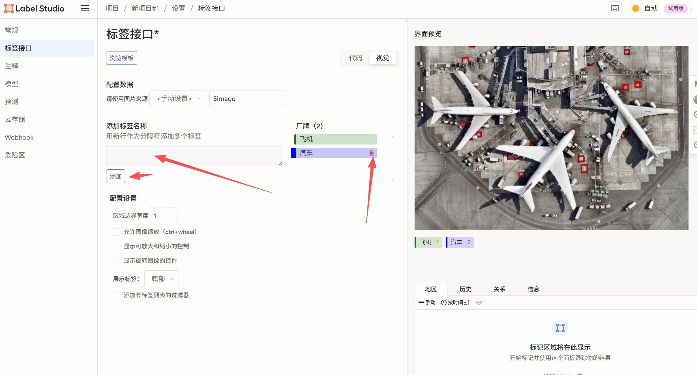
需要删除原本的我们添加我们想要的标签，如我这个图标识别，就app,大文件夹，小文件夹，这样写好标签类型，写好后放在标签前面可以改变标签的颜色，换成顺眼的保存后回到项目即可看到图片了，我们点击图片进行标注(`特别漫长，想要好的模型就别省，能跑就行那就直接库库框，又不是造火箭`)
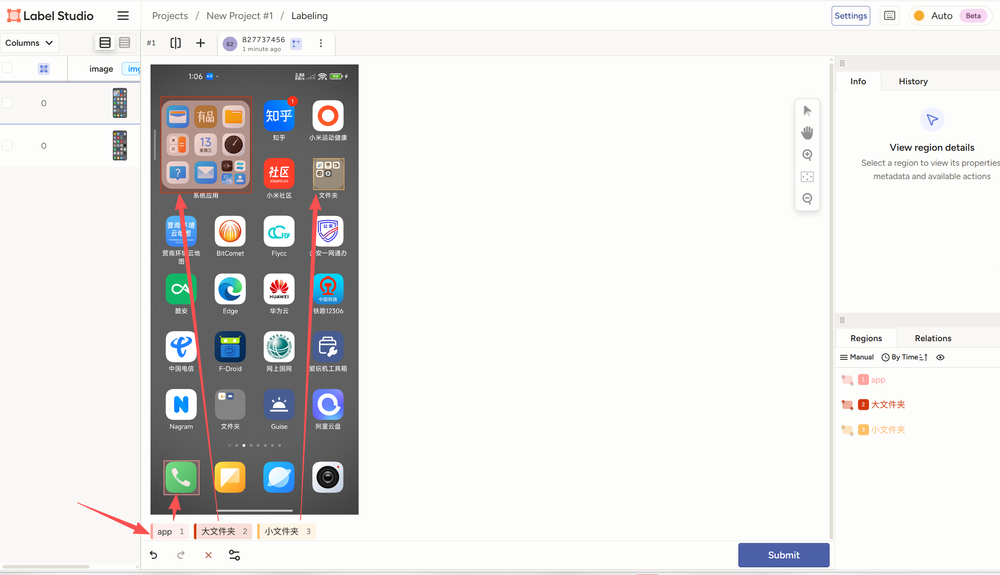
标注完成后点击保存，在选择下一张图像打标签完成后就开始导出数据
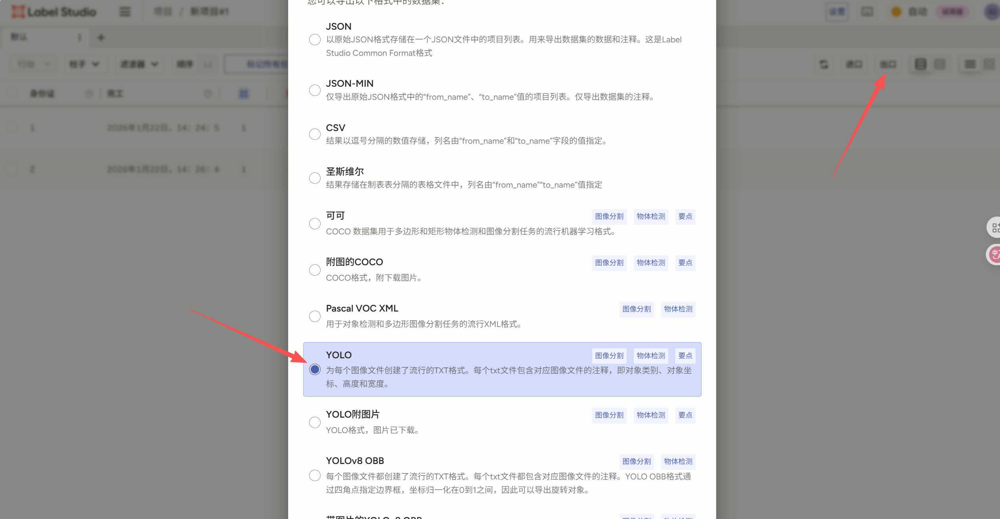

# 选择模型
你可以访问[yolo的模型对比网站](https://docs.ultralytics.com/zh/compare/#community-models-a-note-on-yolo12-and-yolo13)
最终考虑下我使用的是yolo8，中规中矩，你如果有好的设备也可以使用新模型
## 如何选择
- FPS不够降模型，精度不够升模型，先从中等开始调

# 训练
刚刚应该是将标注好的数据下载好了对吧，那就按照yolo的训练目录进行放置吧(不会吗？)不会吧

```python
import zipfile
import os
import shutil
import random
from pathlib import Path

# ============ 配置 ============
zip_path = "project-1-at-2025-08-13-20-18-cc17174d.zip"  # Label Studio 导出的ZIP文件
output_dir = "dataset"    # 解压后数据目录
data_yaml = "data.yaml"   # YOLO数据配置
# =============================

def unzip_dataset():
    print(f"[INFO] 解压数据集: {zip_path}")
    with zipfile.ZipFile(zip_path, 'r') as zip_ref:
        zip_ref.extractall(output_dir)

def find_images_labels():
    """自动查找 images/labels 实际路径"""
    img_dir = None
    lbl_dir = None
    for root, dirs, files in os.walk(output_dir):
        if os.path.basename(root) == "images":
            img_dir = Path(root)
        if os.path.basename(root) == "labels":
            lbl_dir = Path(root)
    if not img_dir or not lbl_dir:
        raise FileNotFoundError("未找到 images/ 或 labels/ 文件夹，请检查导出的ZIP内容")
    return img_dir, lbl_dir

def read_classes():
    classes_file = Path(output_dir) / "classes.txt"
    if not classes_file.exists():
        raise FileNotFoundError("classes.txt 不存在，请确认导出的ZIP中包含它")
    with open(classes_file, "r", encoding="utf-8") as f:
        classes = [line.strip() for line in f if line.strip()]
    return classes

def split_dataset(images_dir, labels_dir):
    print("[INFO] 切分数据集...")
    valid_exts = {'.tif', '.jpg', '.tiff', '.png', '.jpeg', '.bmp', '.webp'}
    img_files = [f for f in images_dir.glob("*") if f.suffix.lower() in valid_exts]
    random.shuffle(img_files)

    total = len(img_files)
    if total < 3:
        raise ValueError("数据集太小，至少需要 3 张图片才能切分 train/val/test")

    if total < 10:
        train_count, val_count = total - 2, 1
    else:
        train_count = max(1, int(total * 0.8))
        val_count = max(1, int(total * 0.1))

    subsets = {
        "train": img_files[:train_count],
        "val": img_files[train_count:train_count + val_count],
        "test": img_files[train_count + val_count:]
    }

    for subset, files in subsets.items():
        (Path(output_dir) / subset / "images").mkdir(parents=True, exist_ok=True)
        (Path(output_dir) / subset / "labels").mkdir(parents=True, exist_ok=True)

        for img in files:
            label = labels_dir / (img.stem + ".txt")
            shutil.copy(img, Path(output_dir) / subset / "images")
            if label.exists():
                shutil.copy(label, Path(output_dir) / subset / "labels")

    print(
        f"[INFO] 切分完成: "
        f"train={len(subsets['train'])}, "
        f"val={len(subsets['val'])}, "
        f"test={len(subsets['test'])}"
    )

def create_data_yaml(classes):
    print("[INFO] 生成 data.yaml")
    yaml_content = f"""
train: {output_dir}/train/images
val: {output_dir}/val/images
test: {output_dir}/test/images

nc: {len(classes)}
names: {classes}
"""
    with open(data_yaml, "w", encoding="utf-8") as f:
        f.write(yaml_content.strip())

if __name__ == "__main__":
    unzip_dataset()
    images_dir, labels_dir = find_images_labels()
    classes = read_classes()
    split_dataset(images_dir, labels_dir)
    create_data_yaml(classes)

```

## 配置vs code
需要下载Jupyter
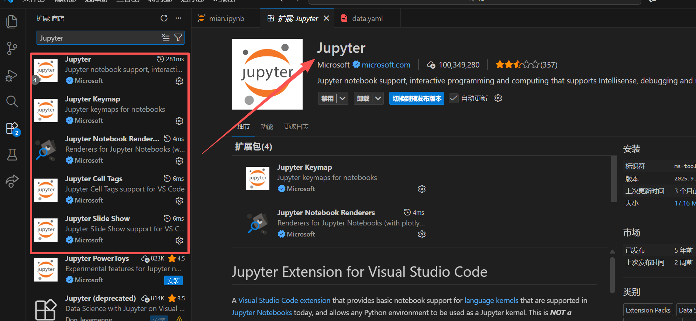
创建一个`mian.ipynb`我们使用代码块来讲解
# 正式开始
和正常python一样，但是是按块运行，我们点击上方的`+代码`我们在第一块写入
```python
from ultralytics import YOLO
import os
```
导入包，第二块
```python
data_yaml_path = "配置文件名称.yaml" 
model_name = '你需要的yolo的训练文件.pt' 
```
下载文件
``` python
print(f"Loading model: {model_name}")
model = YOLO(model_name)
```
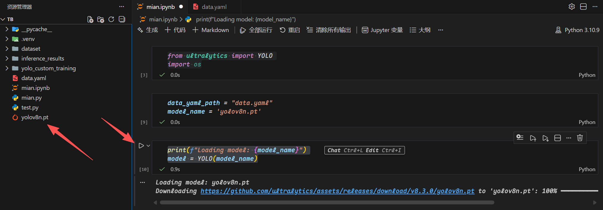
训练脚本
``` python
# --- 4. 启动训练 ---
print("Starting YOLO training...")

results = model.train(
    data=data_yaml_path,  # 使用相对路径，因为它就在当前目录
    epochs=400,           # 设置训练轮数
    imgsz=640,            # 设置图片尺寸
    batch=-1,             # -1 表示自动选择批次大小
    project='yolo_custom_training', #输出文件夹
    name='custom_train_v1',         #二级
    device='0'          # GPU位置
)

print("YOLO 模型训练完成！")
```
点击开始就开始训练，如果训练时发现`CPU`占用暴涨，那就是你缺少东西没有识别到`GPU`新建一个代码块输入
```python
nvidia-smi
```
```python
import torch
torch.cuda.is_available()
```
```python
import torch

print("CUDA 是否可用:", torch.cuda.is_available())
print("GPU 数量:", torch.cuda.device_count())
if torch.cuda.is_available():
    print("GPU 名称:", torch.cuda.get_device_name(0))
else:
    print("当前环境未识别到 GPU")

```
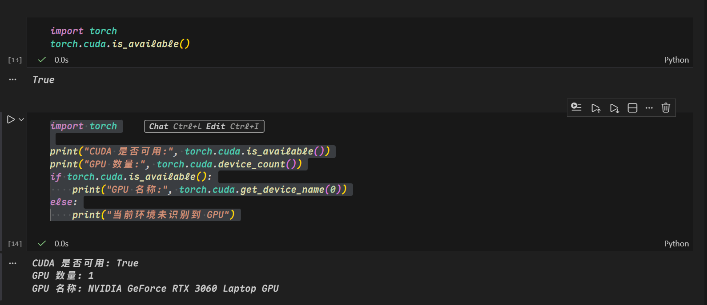
输出为这样代表可以正常识别你的GPU如果为`false`那就应该去看[CUDA安装及环境配置——最新详细版](https://blog.csdn.net/chen565884393/article/details/127905428)
这中间咋折腾不知道，反正你的显卡成功识别就ok了
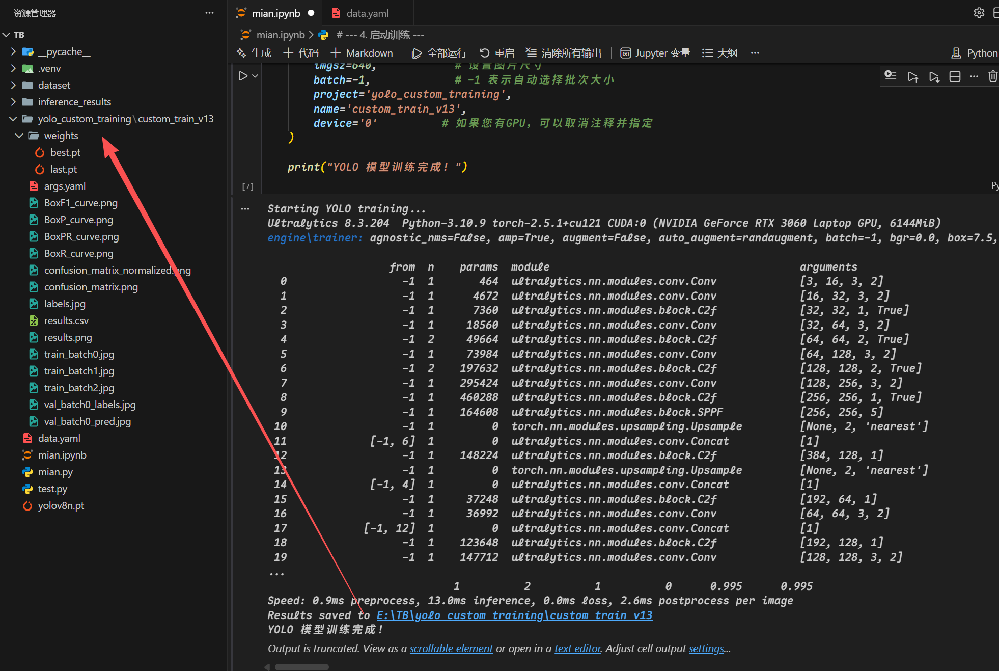
训练完成就长这个样子
如果你需要看损失曲线和矩阵可以使用
``` python
from IPython.display import Image, display
import os

# 1. 设置结果目录
# 请确保这里的路径与您实际训练结果的路径匹配！
# 假设您的项目在 E:\TB\yolo_custom_training\custom_train_v2
results_dir = os.path.join('yolo_custom_training', 'custom_train_v13')

# 2. 打印关键的训练结果图表 (results.png)
# 这个图表包含了：box_loss, cls_loss, dfl_loss, mAP, precision, recall, F1 等所有曲线。
try:
    print("--- 损失和指标曲线 ---")
    results_path = os.path.join(results_dir, 'results.png')
    display(Image(filename=results_path))
except FileNotFoundError:
    print(f"找不到结果文件：{results_path}。请确认训练是否完成。")

# 3. 打印混淆矩阵 (confusion_matrix.png)
try:
    print("--- 混淆矩阵 ---")
    cm_path = os.path.join(results_dir, 'confusion_matrix.png')
    display(Image(filename=cm_path))
except FileNotFoundError:
    pass

# 4. 打印 F1-Confidence 曲线 (F1_curve.png)
try:
    print("--- F1 曲线 ---")
    f1_path = os.path.join(results_dir, 'F1_curve.png')
    display(Image(filename=f1_path))
except FileNotFoundError:
    pass
```

# 最后

``` python
import cv2
from ultralytics import YOLO
import os

# 1. 设置模型路径
# 请确保路径正确！
best_model_path = os.path.join('yolo_custom_training', 'custom_train_v13', 'weights', 'best.pt') 

# 2. 加载模型
model = YOLO(best_model_path) 

# 3. 指定摄像头 (通常是 0)
cap = cv2.VideoCapture(0)

# 检查摄像头是否打开
if not cap.isOpened():
    print("错误: 无法打开摄像头.")
    exit()

print("--- 实时推演已启动，请按 'q' 或 ESC 键退出 ---")

while True:
    # 读取一帧
    ret, frame = cap.read()
    if not ret:
        break

    # 运行 YOLO 推理
    # 注意：这里我们使用 model() 而不是 model.predict() 来直接处理帧
    results = model(frame, conf=0.25, device='0', verbose=False) 

    # 将结果帧绘制到屏幕上 (Ultralytics 的方式)
    annotated_frame = results[0].plot()

    # 显示帧
    cv2.imshow("YOLOv8 Live Inference", annotated_frame)

    # 关键的退出控制：检测 'q' 键或 ESC 键
    key = cv2.waitKey(1) & 0xFF
    if key == ord('q') or key == 27: # ord('q') 是 q 键的ASCII码, 27 是 ESC 键的ASCII码
        break

# 释放资源
cap.release()
cv2.destroyAllWindows()

```
我们打开摄像头实时推理即可看到效果
# 恰饭
ok结束，点个关注不迷路
