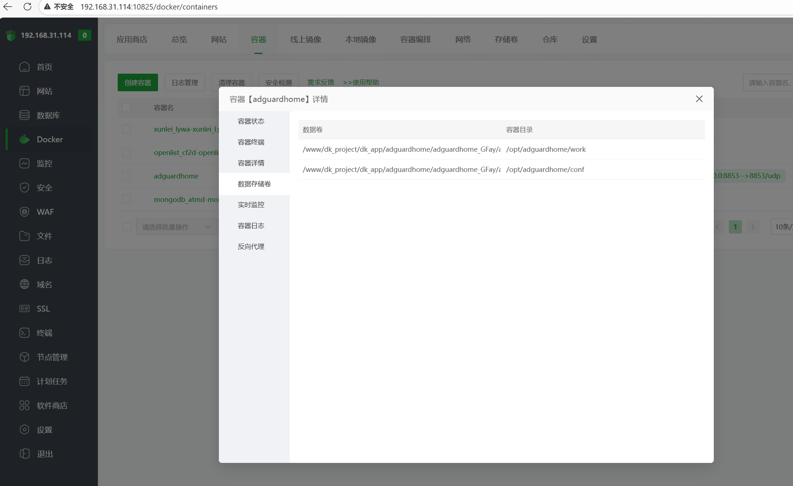
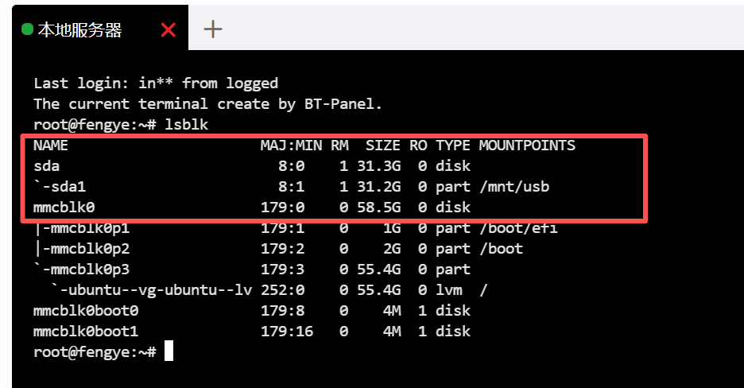
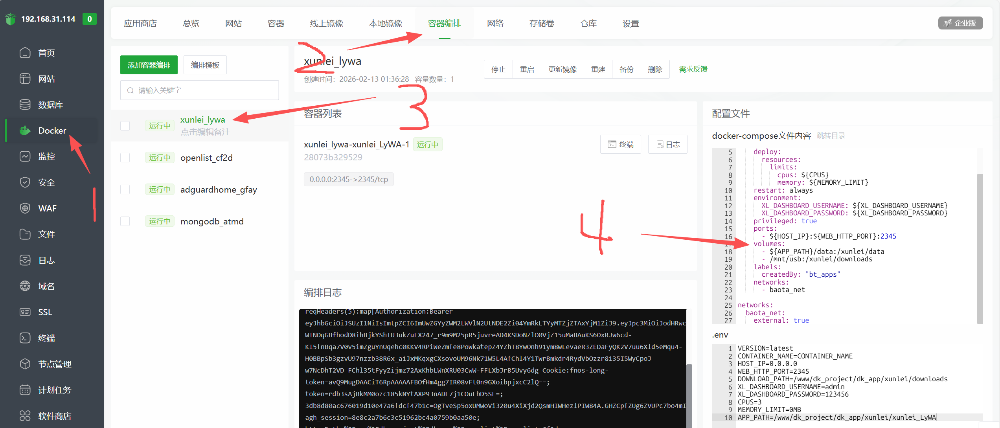
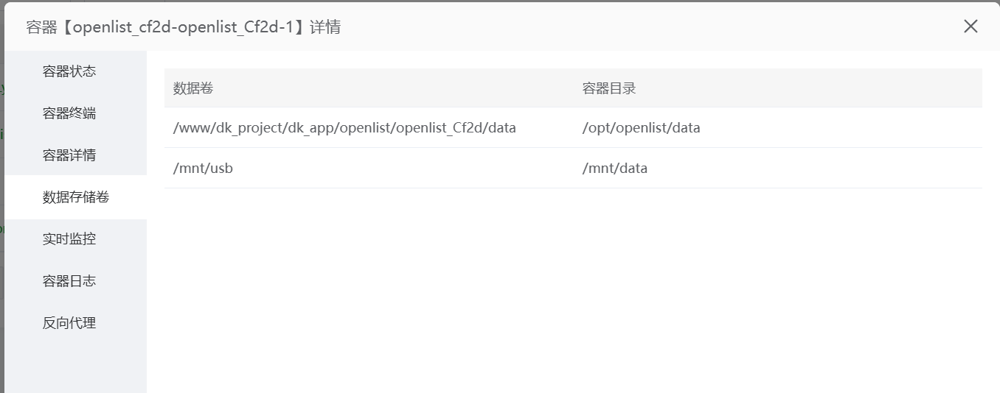

# 前言
最近在折腾废弃轻薄本时我想本地储存一些东西，又不想使用本地储存，机器太老了内存啥的都焊上的，只能拓展u盘，于是嘛便有了本期教程

# 正文
如图默认情况下这个是映射在宝塔的`www`目录下


我们将修改到本地的储存上

先挂载u盘，默认情况下应该是自动识别，但是你需要创建一个目录
- 全程root执行
```bash
lsblk
```

类似这样就是挂载好了
## 挂载u盘

1. 查看U盘
    - 输入命令：`sudo fdisk -l` 查看各硬盘及U盘名字(可以先拔掉u盘在输入查看多出的设备)
2. 新建U盘挂载路径
    - `sudo mkdir /mnt/usb` ，表示将U盘挂载到此路径下，成功后应该就可以查看到U盘内容
3. 挂载U盘
```bash
sudo mount /dev/你的u名称 /mnt/usb
```
4. 查看内容
```bash
ls /mnt/usb
```
应该就可以看到u盘中的内容了

# 开始更换
依次点击 `docker` -> `容器编排` -> `选择你要修改的容器` -> `配置文件`

将这里改成你需要映射的目录可以参考我这个直接挂上

然后就大功告成了