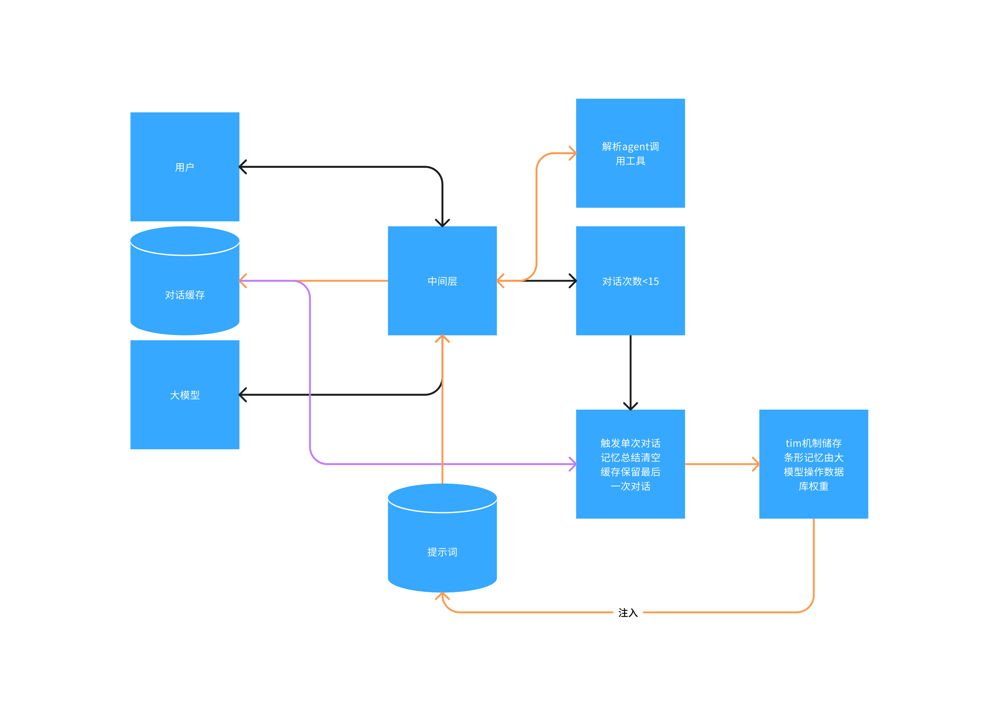
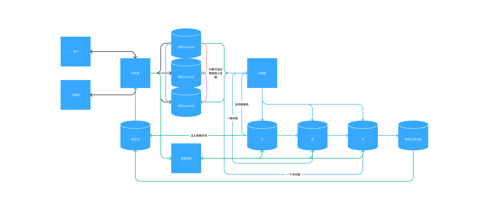

# 前言
崽崽，一个我理想中的猫娘，主要用在我的日常陪伴，在添加功能和技能时我发现记忆问题好像都是大模型的缺陷，虽然市面上有很多也有很多不错的项目可以参考如向量数据库和前不久我看到的`memu`这些不错的记忆储存方案，但是我项目是小项目啊，我只需要她可以陪我聊天即可，不想使用市面上的方案，于是便开启了邪修

# 第一版
我的第一版方案是持续存储，就什么对话都储存下来，因为想着模型毕竟支持几百k的上下文不缺这一点，但是我发现储存太多也是问题，于是为了节省token也是使用了区块读取，如始终保持大模型只能读取到最近聊天的5条上下文，但是我发现还是达不到我想要的，后面又写了一个搜索函数，当大模型返回关键词进行记忆检索，后面反正就是使用了一段时间也是废弃了这个方案

# 第二版
第二版我觉得采用一直修剪的方式，也是目前部分使用的方法，到达对话次数时触发记忆总结然后再通过返回的内容注入提示词，这样确实很棒但是没有长期的记忆，于是很快就下岗了

# 第三版
这一版本基于第二版本进行的魔改解决长期记忆的问题，于是引入了`tim`的储存方法[相关论文](https://arxiv.org/pdf/2311.08719)，通过插入、遗忘与合并操作我编写了一套使用`MongoDB`进行储存，使用了记忆插入，类似的合并，同时加入权重，当有一个记忆被反复提及就进行权重增加，当超出时间判断为记忆遗忘进入冷静期间，减少被大模型使用概率，同时我引入了大模型进行数据库操作类似`agent`我想将数据库交给大模型也是我干过最蠢的，大模型胡乱操作数据库头疼，然后维护这一坨完全没了灵感也放弃了如图

# 最终版本
最终版本也是我当前使用的版本，虽然没有开发完成但是不影响我分享

我采用了破罐子破摔，抛弃`MongoDB`数据库，转向本地，既然算法不行那就重复，如图你需要编写一个完美运行的压缩层提示词，对，就是提示词

## 设想
假设用户发送了一条消息，中间层将消息写入`1号`对话同时请求大模型，大模型响应后中间层给储存，再返回给用户，而当对话到达10条时就由`中间层切换到储存2号`，`2号满了就进入3号`，但是需要设定规则如果进入3号时就需要压缩层将1号的内容进行压缩并储存再天的数据库中，以此类推你需要一个上下文长一点的大模型这样你将始终`保持有10~20条数据是与大模型再交互`，不会轻易忘记你们之间的对话，同时保持始终有两个数据库在活动，也可以灵活变通毕竟3个活动数据库如你15条消息就清除前一个数据库，这样最低也有5条的对话聊天消息，当天结束后定时进行消息压缩将今天的精彩内容进行压缩总结，完成后传递给`周`，以此类推，你将得到如果短期被提及大模型也知道如果你询问长期的，大模型可以使用搜索函数去读取3个长期的数据库，如果你经常提及的内容自然会被大模型储存进下一个环节，长期不说的自然会被大模型评估成遗忘，简直good(仅限当时想出这个想法的我)

# 结尾
大概就这样如果有更好的想法也可以分享一下
